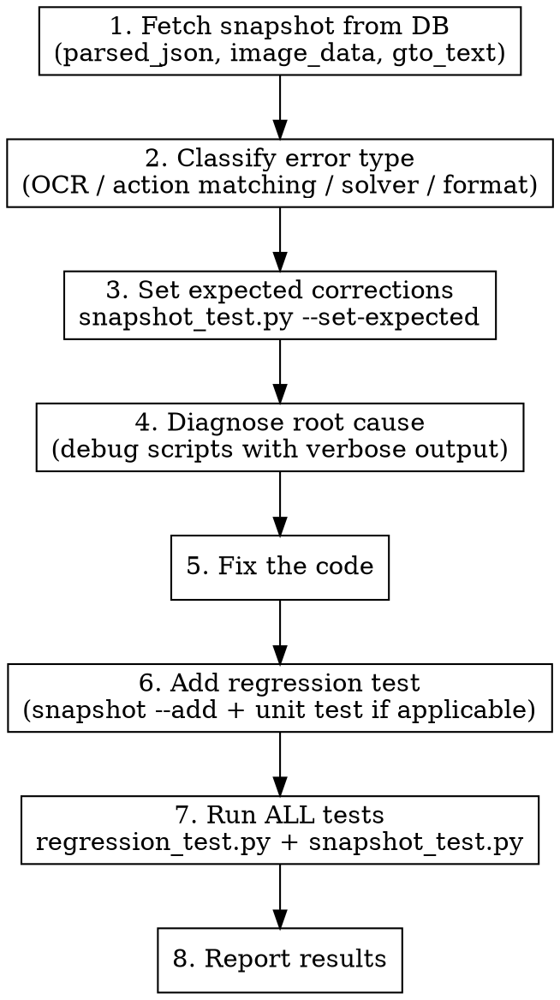

# Fix Hand Analysis

Systematic workflow: diagnose any analysis bug → fix code → add regression test → verify.

Covers: OCR misparse, action matching errors, missing solver data, wrong GTO output, bad formatting.

## Input Format

```
/fix-hand H2507 hero_hand=KdQs
/fix-hand H2510 board=Jc6d5d
/fix-hand H2506 — check-raise 應該有 solver 數據
/fix-hand H2512 hero_position=BB players_at_table=6
```

Hand ID + field=value corrections, or a description of what's wrong.

## Workflow



## Step 1: Fetch Snapshot

Write to `scripts/_tmp.py` and run:

```python
import asyncio, os, sys, json
sys.path.insert(0, os.path.dirname(__file__))
import asyncpg

async def main():
    conn = await asyncpg.connect(os.environ["SUPABASE_CONN"], statement_cache_size=0)
    row = await conn.fetchrow(
        "SELECT parsed_json, expected_json, gto_text, image_data IS NOT NULL as has_image "
        "FROM analysis_snapshots WHERE hand_id = $1", "HXXXX"
    )
    await conn.close()
    parsed = json.loads(row["parsed_json"])
    print("=== PARSED JSON ===")
    print(json.dumps(parsed, indent=2))
    print("\n=== GTO TEXT ===")
    print(row["gto_text"][:500] if row["gto_text"] else "None")
    if row["has_image"]:
        row2 = await conn.fetchrow(
            "SELECT image_data FROM analysis_snapshots WHERE hand_id = $1", "HXXXX"
        )
        with open("/tmp/HXXXX.jpeg", "wb") as f:
            f.write(row2["image_data"])
        print("\nImage saved to /tmp/HXXXX.jpeg")

asyncio.run(main())
```

Run: `python scripts/_tmp.py`
(Always start `_tmp.py` with `from dotenv import load_dotenv; load_dotenv()`
— `source .env` is blocked by a PreToolUse hook.)

## Step 2: Classify Error Type

| Error Type | Symptoms | Key Files |
|-----------|----------|-----------|
| **OCR** | Wrong hero_hand, board, position, player count | `scripts/ocr/table_parser.py`, `card_matcher.py`, `panel_parser.py`, `n8_parser.py` |
| **Action Matching** | Wrong action mapped, missing solver data after opponent action | `scripts/analyze_hand.py` (action walking), `scripts/gto_api.py` (find_closest_action) |
| **Solver/API** | "無 solver 數據" when data should exist, wrong depth/gametype/padding | `scripts/analyze_hand.py` (params), `scripts/gto_api.py`, `scripts/icm_modes.py` |
| **Formatter** | Wrong range compression, missing suit diff, bad combo display | `scripts/gto_formatter.py` |
| **LLM Parse** | Text-input hand parsed incorrectly | `src/gemini_session.py` (prompt/schema) |
| **Follow-up / Tool Call** | User asks a follow-up question about an already-analyzed hand and gets "no data" / wrong range / refusal | `src/gemini_session.py` (`_execute_query_gto`, tool declarations), check `tool_calls` DB table |

## Step 3: Set Expected

```bash
python scripts/snapshot_test.py --set-expected HXXXX '{"hero_hand":"KdQs"}'
```

Only set fields the user reported wrong.

## Step 4: Diagnose

### OCR Issues
**Read the image first** with Read tool to visually confirm expected values.

Debug `_find_hero_cards`, `_detect_suit_bgr`, `_ocr_card_rank`, or panel parser with verbose output. Check blob ratios, BGR values, template confidence.

### Action Matching Issues
Trace the action walking loop step by step:
1. Print each action's `target_size` and available actions from API
2. Check what `find_closest_action_postflop` returns
3. Verify the accumulated `flop_actions` / `turn_actions` string
4. Query `get_spot_solution` with the final params

### Solver/API Issues
Check: depth calculation, preflop padding (6→8 for MTTGeneral), gametype selection, ICM params. Query `get_next_actions` and `get_spot_solution` directly.

### Formatter Issues
Run `analyze_hand_full(expected_json)` and compare raw solution data vs formatted text.

### Follow-up / Tool Call Issues

The bot exposes `query_gto` / `query_next_actions` / leak tools to Gemini for
follow-up questions. Symptoms: "無法獲取數據", "工具查詢時回傳沒有數據",
wrong range breakdown, or the LLM fabricating ranges.

**Every tool call is persisted to the `tool_calls` DB table and logged.** Use
them — don't guess.

1. **Find the request in `tool_calls`** (authoritative, survives log rotation):
   ```sql
   SELECT id, created_at, request_id, tool_name, tool_args, latency_ms,
          substring(tool_result, 1, 400) AS result_preview
   FROM tool_calls
   WHERE hand_id = 'HXXXX'
   ORDER BY created_at DESC
   LIMIT 20;
   ```
   Or by chat + time window if `hand_id` wasn't set yet. Every row carries a
   `request_id` — once you have one, filter the entire request:
   ```sql
   SELECT tool_name, tool_args, tool_result, latency_ms
   FROM tool_calls WHERE request_id = 'ab12cd34' ORDER BY created_at;
   ```

2. **Cross-reference with the live log** for surrounding context (parse,
   analyze timings, LLM reasoning hints):
   ```bash
   docker exec ai-poker-wizard-bot-1 grep 'req=ab12cd34' /app/logs/gemini_session.log
   ```
   Every log line within one user request carries the same `[req=XXXXXXXX]`
   tag (ContextVar-propagated, works across async). **Always filter by
   `req=` first** — `[chat=XXX]` alone can interleave multiple requests.

3. **Reproduce the exact failing tool call locally** without the LLM loop.
   Build the context from the snapshot's `parsed_json`, then invoke
   `session._execute_query_gto` directly with the args captured from
   `tool_calls.tool_args`:
   ```python
   from dotenv import load_dotenv; load_dotenv()
   from analyze_hand import analyze_hand_full
   from gemini_session import GeminiSessionManager

   ctx = analyze_hand_full(PARSED_JSON_FROM_SNAPSHOT)
   session = GeminiSessionManager.__new__(GeminiSessionManager)
   session.hand_contexts = {1: ctx}
   session.pending_images = {}
   session.last_hand_ids = {}
   session.db = None
   import logging
   session._logger = logging.getLogger("repro")
   session._logger.setLevel(logging.DEBUG)
   session._logger.addHandler(logging.StreamHandler())

   result = session._execute_query_gto(1, TOOL_ARGS_FROM_DB)
   print(result)
   ```

4. **Common follow-up failure modes**:
   - **Preflop length mismatch**: LLM echoes the original `players_at_table`-length
     preflop (e.g. 7 positions for 7-max), but the solver (MTTGeneral) needs 8.
     Fixed by the leading-F auto-pad in `_execute_query_gto` — if it reappears,
     check the padding block and the ctx `preflop_actions` length.
   - **Raise code normalization drift**: LLM sends `R1.1` (bb), normalize
     rewrites to a different code via `find_closest_action_by_pot_pct`. The
     cache-hit shortcut `_overrides_match_played_line` sidesteps this when
     overrides match the played line — if they're close-but-not-equal you
     still hit the API path.
   - **Cache not used**: `has_override=True` blocks the cache. Check
     `_find_cached_spot` + `_overrides_match_played_line` — overrides are
     compared against `hero_spot["params"]`, NOT `street_states` (the latter
     is a start-of-street snapshot with incomplete action strings).
   - **LLM constructed an invalid hypothetical**: verify the user actually
     asked about the played line vs a hypothetical. If hypothetical, the
     API call is correct and the LLM's action codes are the bug.

5. **When an API query returns empty**, the tool result now includes the
   resolved params — read them to spot the problem immediately without
   re-running anything.

## Step 5: Fix Code

Apply minimal fix. For core analysis logic bugs (action matching, range compression, API params), also add a unit test in `scripts/regression_test.py` with the `@test` decorator.

## Step 6: Add Regression Test

```bash
python scripts/snapshot_test.py --set-expected HXXXX '{"field":"value"}'  # if not done
python scripts/snapshot_test.py --add HXXXX
python scripts/snapshot_test.py HXXXX
```

## Step 7: Run ALL Tests

```bash
python scripts/regression_test.py
python scripts/snapshot_test.py
```

Both must pass before reporting done.

## Log & Data Sources (cheat sheet)

- **`tool_calls` DB table** — every LLM tool invocation with `request_id`,
  `hand_id`, `tool_args` (jsonb), `tool_result`, `latency_ms`. Primary
  source for follow-up debugging. Outlives log rotation.
- **`analysis_snapshots` DB table** — `parsed_json`, `gto_text`,
  `coaching_text`, `image_data` (bytea). Source for reproducing any hand.
- **`/app/logs/gemini_session.log`** (inside `ai-poker-wizard-bot-1`) —
  full tool calls at INFO, tool results at DEBUG, resolved API params on
  empty results at WARNING. **Every line tagged `[req=XXXXXXXX]`** —
  filter by that, not `[chat=...]`.
- **`docker logs ai-poker-wizard-bot-1`** — same stream (mirrored to
  stdout) plus top-level bot events.

## Important Rules

- **Always write Python to `scripts/_tmp.py`**, never `python -c`
- **Use `from dotenv import load_dotenv; load_dotenv()`** — `source .env`
  is blocked by a PreToolUse hook
- **Read the image visually** when the error involves OCR
- **Every fix needs a regression test** — snapshot `--add` and/or unit test
- **Don't modify expected_json fields the user didn't mention**
- **For action matching / solver bugs**, run `analyze_hand_full(expected_json)` to verify full output after fix
- **For follow-up/tool-call bugs**, always pull the actual args from
  `tool_calls` before guessing — don't assume what the LLM sent
- **Filter by `request_id`**, not `chat_id`, when reading logs — concurrent
  requests interleave otherwise
- **No exceptions** — if user provides expected result, fix the code until OCR/analysis matches. Don't skip or defer OCR issues as "known limitations". The only valid reason to not fix is if you believe the user's expected result is wrong (and you must explain why).
