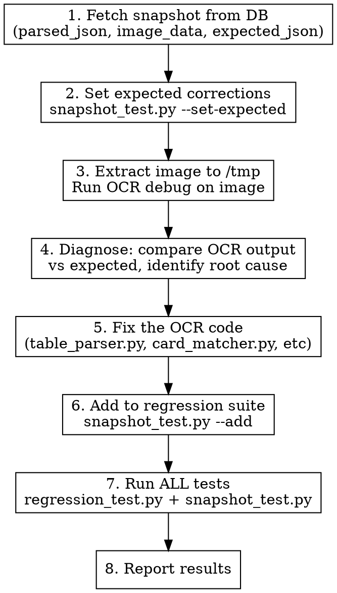

# Fix OCR Misparse

Systematic workflow: diagnose OCR bug → fix code → add regression test → verify.

## Input Format

```
/fix-ocr H2507 hero_hand=KdQs
/fix-ocr H2510 board=Jc6d5d
/fix-ocr H2512 hero_position=BB players_at_table=6
```

Hand ID + one or more `field=value` corrections.

## Workflow



## Step Details

### 1. Fetch Snapshot

Write to `scripts/_tmp.py` and run:

```python
import asyncio, os, sys, json
sys.path.insert(0, os.path.dirname(__file__))
import asyncpg

async def main():
    conn = await asyncpg.connect(os.environ["SUPABASE_CONN"], statement_cache_size=0)
    row = await conn.fetchrow(
        "SELECT parsed_json, expected_json, image_data IS NOT NULL as has_image "
        "FROM analysis_snapshots WHERE hand_id = $1", "HXXXX"
    )
    await conn.close()
    parsed = json.loads(row["parsed_json"])
    print(json.dumps(parsed, indent=2))
    if row["has_image"]:
        row2 = await conn.fetchrow(
            "SELECT image_data FROM analysis_snapshots WHERE hand_id = $1", "HXXXX"
        )
        with open("/tmp/HXXXX.jpeg", "wb") as f:
            f.write(row2["image_data"])
        print("Image saved to /tmp/HXXXX.jpeg")

asyncio.run(main())
```

Run: `set -a && source .env && set +a && python scripts/_tmp.py`

### 2. Set Expected

```bash
python scripts/snapshot_test.py --set-expected HXXXX '{"hero_hand":"KdQs"}'
```

### 3. OCR Debug

**Always Read the image first** with the Read tool to visually confirm the expected values.

Then write a debug script to `scripts/_tmp.py` that:
1. Loads image → detect_regions → parse_table
2. Runs the specific detection function with verbose output
3. Compares detected vs expected

**For hero card issues**, debug `_find_hero_cards`:
- Extract hero crop area, find blob, check blob ratio
- Test `_detect_suit_bgr` on both tall and tighter blobs
- Test `_ocr_card_rank` on both blobs
- Print intermediate BGR values, is_red classification, hull defects

**For board card issues**, debug `_find_board_cards`:
- Extract center board region
- Check card contour detection
- Test suit/rank on each card

**For action/position issues**, debug the panel parser:
- Run `parse_panel` on the panel region
- Check column detection and entry parsing

### 4. Diagnose

Common root causes:

| Symptom | Likely Cause | Where to Fix |
|---------|-------------|--------------|
| Wrong suit (d↔s, h↔c) | Card artwork confuses suit contour analysis | `table_parser.py:_detect_suit_bgr` |
| Wrong suit (red↔black) | Dark pixel color average skewed by artwork | `table_parser.py:_detect_suit_bgr` is_red threshold |
| Wrong rank | Tall blob includes artwork, OCR confused | `table_parser.py:_find_hero_cards` blob handling |
| Wrong board card | Template matching confidence too low | `card_matcher.py` or `table_parser.py:_find_board_cards` |
| Wrong position | Panel OCR misread | `panel_parser.py` |
| Wrong player count | Preflop entry count heuristic | `n8_parser.py:_assemble_hand` |

### 5. Fix Code

Key OCR files:
- `scripts/ocr/table_parser.py` — hero cards, board cards, suit detection
- `scripts/ocr/card_matcher.py` — template-based card identification
- `scripts/ocr/panel_parser.py` — action panel parsing
- `scripts/ocr/n8_parser.py` — assembles hand JSON from table + panel
- `scripts/ocr/region_detector.py` — table/panel region splitting

### 6. Add Regression Test

```bash
python scripts/snapshot_test.py --add HXXXX    # Flags + stores GTO output
python scripts/snapshot_test.py HXXXX          # Verify single hand
```

### 7. Run ALL Tests

```bash
python scripts/regression_test.py              # Must be 0 failures
python scripts/snapshot_test.py                # Must be 0 failures
```

Both must pass before reporting done.

## Important Rules

- **Always write Python to `scripts/_tmp.py`**, never `python -c`
- **Always `set -a && source .env && set +a`** before running scripts
- **Read the image visually** (Read tool on /tmp/HXXXX.jpeg) to confirm the expected values before starting debug
- **Every fix needs a regression test** — the snapshot test via `--add` counts
- **Don't modify expected_json fields the user didn't mention** — only set what was reported wrong
