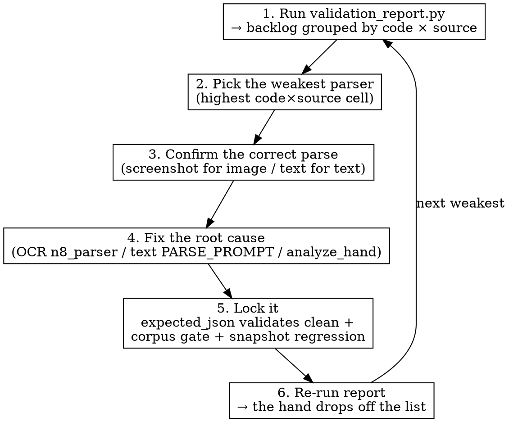

# Validation Backlog → Parser Improvement Loop

The rules validator (`scripts/hand_validator.py`) flags any parsed hand that breaks
poker rules (orphan call, act-after-fold, dup card, dropped seat). This skill turns
those detections into **systematic parser/OCR fixes** and locks each one so it can't
regress. It is the "close the loop" companion to the runtime validator.

**Iron rule:** every fix ends with the corrected parse validating clean AND the
corpus gate + snapshot regression green. A detection isn't "closed" until it's locked.

## Loop



## 1. Read the backlog

```bash
python scripts/validation_report.py                  # grouped summary + per-hand list
python scripts/validation_report.py --code DUP_CARD  # focus one failure mode
python scripts/validation_report.py --source image   # focus one parser (image/text)
python scripts/validation_report.py --worklist       # ready-to-run /fix-hand commands
python scripts/validation_report.py --json           # machine-readable
```

The **`By failure mode × source`** table is the prioritization signal — it names the
weakest parser:

| Pattern in the table | Most likely root cause | Where to fix |
|---|---|---|
| `ACT_AFTER_FOLD` heavy on **image** | OCR mis-attributes a live action to a folded seat | `scripts/ocr/n8_parser.py` (`_build_streets`, `_fix_folded_players`), see [[heads-up-villain-position-strip]] |
| `DUP_CARD` heavy on **image** | OCR reads the same card twice (hero vs board) | `scripts/ocr/` card localization/classification; consider `/retrain-card-classifier` |
| `ORPHAN_CALL` heavy on **image** | a villain bet was dropped, leaving a bare Call | `scripts/ocr/panel_parser.py` action assembly |
| `PREFLOP_LEN` heavy on **text** | the text parser drops a pre-flop seat | `src/gemini_session.py` `PARSE_PROMPT` |

Two statuses:
- **UNREVIEWED** — only a raw parse exists; the correct answer is unknown → confirm first.
- **STALE_EXPECTED** — a reviewed `expected_json` EXISTS but itself breaks the rules.
  The snapshot suite is passing on a *wrong* answer ([[snapshot-expected-can-be-stale]]).
  Re-correct the expected_json before (or instead of) touching parser code.

## 2. Fix one hand

Hand off to the **`fix-hand`** skill — it already automates diagnose → fix → regression
test → verify. The worklist prints the exact commands:

```bash
python scripts/validation_report.py --worklist
# → /fix-hand H3485  — ORPHAN_CALL@8s: HJ 跟注但前面沒有任何下注…
```

For each hand:
1. **Confirm** the correct parse — for image, look at the screenshot (`analysis_snapshots.image_data`); for text, re-read the user_input. Never trust a STALE_EXPECTED blindly.
2. **Set** the corrected parse: `python scripts/snapshot_test.py --set-expected H#### '{...}'`.
3. **Verify the correction is rules-clean** before fixing code:
   ```bash
   python -c "import sys; sys.path.insert(0,'scripts'); import json; \
     from hand_validator import validate_hand; \
     print(validate_hand(json.loads(open('/tmp/h.json').read())).ok)"
   ```
   If the corrected expected still fails the validator, the correction is wrong — redo it.
4. **Fix the root cause** in the parser/OCR (the table above). Follow the repo's
   Bug Fix Standards — fix it completely, every field.
5. **Lock**: `--update H####` then `--add H####`; add/extend a unit test in
   `scripts/regression_test.py` for the parser fix.

## 3. Verify the loop closed

```bash
python scripts/regression_test.py -k validator   # corpus gate: still ⊆ triaged set
python scripts/snapshot_test.py H####            # the fixed hand
python scripts/validation_report.py              # the hand is gone from the backlog
```

When the fix lands, the hand **drops off the backlog automatically** (the report
recomputes `validate_hand` over the new parse) and the corpus gate guards against
re-introduction.

## If a backlog entry is a validator false positive

If a flagged hand is actually a *correct* parse the validator shouldn't reject (a new
participant-model or aggression edge case), do NOT just whitelist it. Fix
`scripts/hand_validator.py` (`derive_participants` / `is_aggression`), add a unit test
proving it validates clean, and only then update `KNOWN_VALIDATOR_FLAGS`. See the
design doc `docs/handoffs/2026-06-08-poker-rules-validator.md` §3c and [[hand-rules-validator]].

## Related
- `/fix-hand` — the per-hand diagnose→fix→test automation this skill feeds.
- `/verify-ocr-no-regression`, `/ocr-benchmark` — guard image parsing after OCR fixes.
- `/retrain-card-classifier` — when DUP_CARD/card errors point at the CNN.
- [[hand-rules-validator]], [[snapshot-expected-can-be-stale]], [[heads-up-villain-position-strip]].
```
