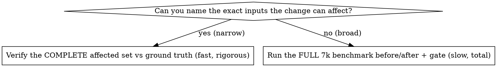

# Verify OCR No-Regression

## Overview

An OCR change is **not done** until you have *proven* it doesn't make recognition
worse on the 7k-image benchmark. "It's a narrow change / obviously safe / only
touches one hand" is reasoning, not proof — **measure it.** A fix that repairs 2
hands but silently breaks 5 others is a net regression you will not notice
without running the gate.

This is a hard gate: **any hand that recognized correctly before and is wrong
after = BLOCK.** Do not commit or merge until the regression is gone or the human
explicitly signs off.

## When to use

Any diff under `scripts/ocr/**` or the card classifier/model: `table_parser.py`,
`panel_parser.py`, `n8_parser.py`, `region_detector.py`, board/hero localization,
`classifier/` (CNN, infer, ensemble), repair rules (`_repair_*`,
`_corner_rank_overrides`, suit/rank logic), confidence thresholds/gates, or a
CardCNN retrain. Not for changes that can't affect image→JSON (GTO formatter,
ICM, coaching text).

## The gate (ALL must hold before commit/merge)

1. `python scripts/regression_test.py` → still green (unit level).
2. `python scripts/snapshot_test.py` → pass-count **not lower** than before.
3. **No-regression on the 7k benchmark** → no hand that passed on the base
   revision now fails. This is the step people skip. Do not skip it.

## Step 3 — pick the verification by blast radius



**Narrow change** (a repair rule for one rank/suit, a threshold, one glyph): the
change can only affect a knowable subset, so checking that whole subset is a
*complete* bound on regressions — faster AND more rigorous than sampling.
Instrument the changed code path to log when its decision diverges from the old
behavior, run it over the ground-truth subset it can touch, and count
divergences on hands where ground truth says the old answer was correct
(= regressions) vs wrong (= fixes).
Example: a guard that only ever flips a hero card between `A` and `4` can only
regress hands whose true hero card is a `4`; verify **all** true-4 hands
(`hero_hand` rank == '4' in `ground_truth.jsonl`) and confirm zero flip a true 4
to A. Zero divergence on that complete set = mathematically no regression.

**Broad change** (region detection, hero/board localization, the CNN/ensemble,
model weights — anything whose blast radius is "any image"): run the full
benchmark on base and on your branch, then gate:

```bash
GT=data/pokercraft_corpus/ground_truth/ground_truth.jsonl
IMG=data/hand_images/img
# baseline — check out main / merge-base first (OCR is deterministic, so cache
# this per base commit and reuse it):
python scripts/ocr_benchmark.py --images $IMG --ground-truth $GT --out /tmp/ocr_base --concurrency 8
# candidate — on your branch with the change:
python scripts/ocr_benchmark.py --images $IMG --ground-truth $GT --out /tmp/ocr_head --concurrency 8
# gate (exit 1 = a hand regressed):
python scripts/ocr_regression_gate.py --base /tmp/ocr_base --head /tmp/ocr_head
```

`ocr_regression_gate.py` reports `fixes` (good) and `regressions` (any hand that
passed on base, fails now) and **exits non-zero on any regression**. Headline
`hand_exact_rate` / `critical_error_rate` in each `summary.json` must also not
move the wrong way.

## The block rule

`ocr_regression_gate.py` exits non-zero, or your blast-radius check finds a
divergence on a previously-correct hand → **STOP. Do not commit/merge.** Either
fix the regression and re-run, or get the human's explicit sign-off to ship a
known regression. Silent net-negative changes are the failure mode this skill
exists to prevent.

## Rationalizations — all mean STOP and run the gate

| Excuse | Reality |
|--------|---------|
| "It's a tiny/narrow change, can't regress much" | Then the blast-radius check is cheap. Run it. Narrow ≠ zero. |
| "regression_test + snapshot pass, good enough" | Those cover <100 hands. The 7k benchmark is where corpus-wide regressions show. |
| "The benchmark is slow / I'll run it later" | Later = after it shipped. Run the blast-radius subset now; it's minutes. |
| "The regression looks unrelated / pre-existing" | Re-run on base to prove it's pre-existing. If it passed on base, you caused it. |
| "It only regresses 1 hand but fixes 3" | Net-positive is still a regression on that 1. Block, then make it strictly non-negative or get sign-off. |
| "OCR is flaky, that hand is noise" | OCR is deterministic per image. Same image → same output. It's not noise. |

## Red flags

- Committing an `scripts/ocr/**` change having run only `regression_test.py`.
- Claiming "no impact" without having run anything on the 7k corpus.
- Skipping the baseline run and eyeballing only the candidate numbers.
- "I'll trust the reasoning" — reasoning is the hypothesis; the gate is the test.

## Related

`retrain-card-classifier` (a retrain is always a broad change — full gate
required), `fix-hand` (per-hand fixes still run this gate), `snapshot_test.py`
(deterministic L1/L2 layer, complements but does not replace the benchmark).
